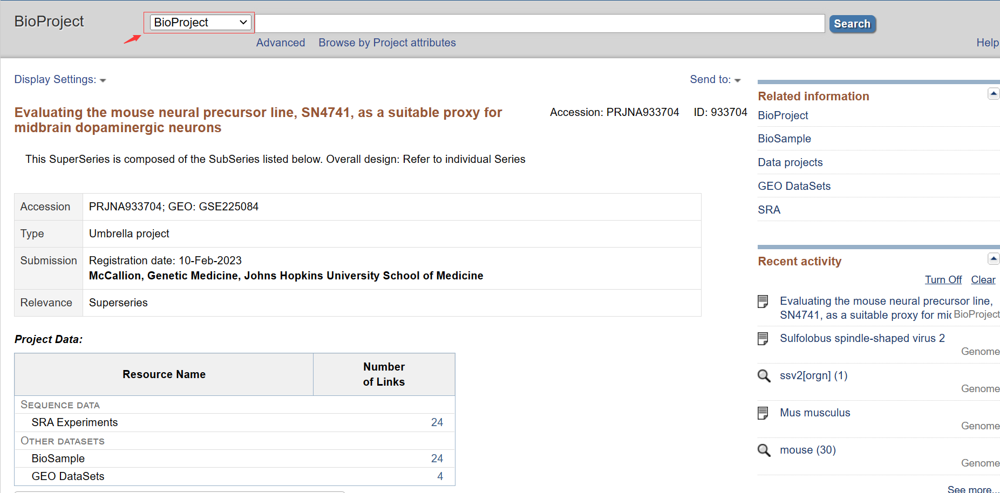
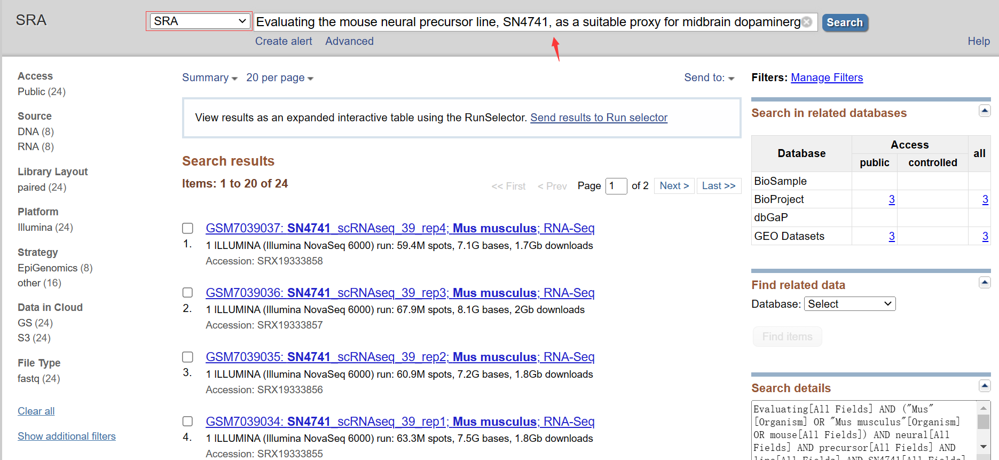
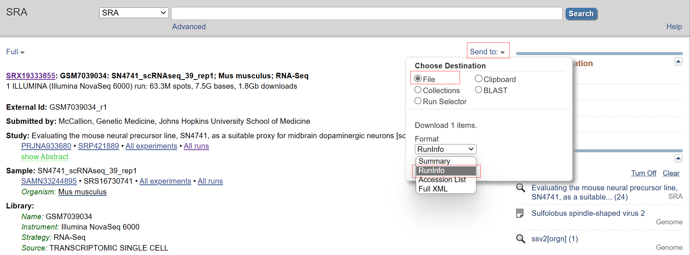
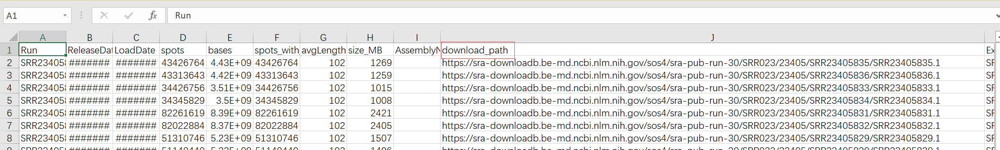
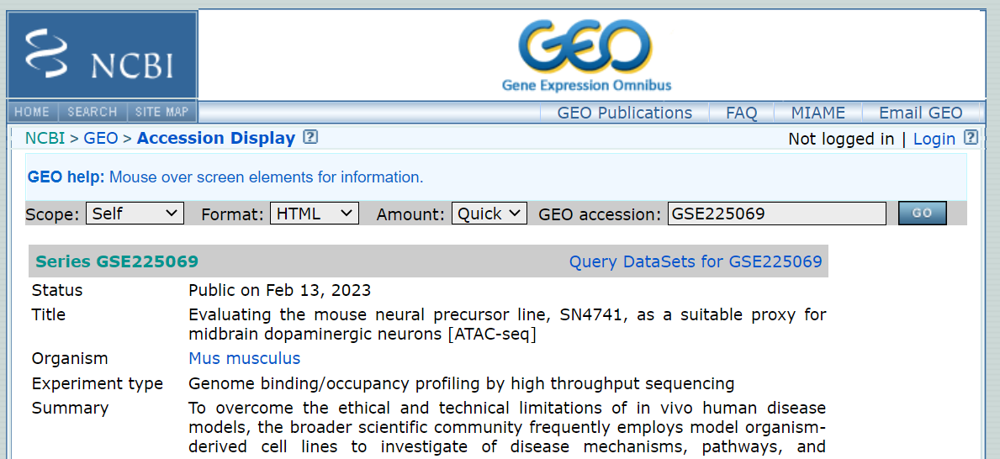
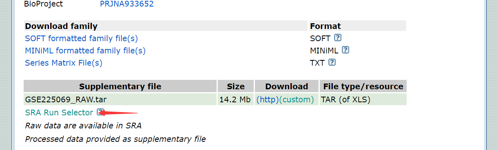
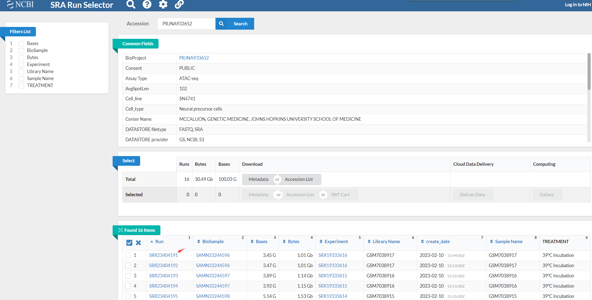
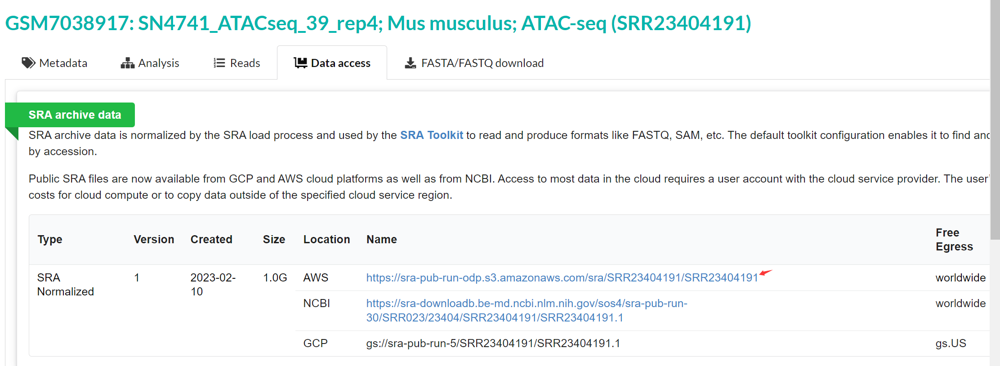

# 安装环境与数据下载

#### 1. 安装miniconda
   去官网下就行，不用清华源
   ```sh
   wget -c https://repo.anaconda.com/miniconda/Miniconda3py310_23.1.0-1-Linux-x86_64.sh
   bash Miniconda3-py310_23.1.0-1-Linux-x86_64.sh
   ```
   ```sh
   conda create -n env_name
   conda activate env_name
   ```

#### 2. 测序原始数据下载
__Plan A__: 在NCBI下载
   在NCBI `Bioproject`中找到合适的数据
   

   切换数据库为`SRA`，查找对应的项目名称
   

   点进一个sample，选择`send to`中的`file`成为`RunInfo`，会自动生成csv
   可以看一下`All runs`，里面有详细的测序信息
   

   csv中有相应的下载路径
   注意在下载之前，先用A列的SRA序号确认样品，然后再用J列下载路径下载。
   
   ```sh
   nohup wget https://sra-downloadb.be-md.ncbi.nLm.nih.gov/sos4/sra_pub-run-30/SRR023/23405/SRR23405836/SRR23405836.1 &
   ```
__Plan B__：从`SRA Run Selector`下载 - _recommended_
   从GEO的数据库进入
   
   底端有`Run SRA Selector`
   
   选择相应的样本
   
   从`Metadata`转到`Data access`, 用给出的下载路径下载
   
   ```sh
   nohup wget https://sra-pub-run-odp.s3.amazonaws.com/sra/SRR23404191/SRR23404191 &
   ```
__Plan C__：从`SRA Explorer`下载
&emsp;我还没有成功过。

__Plan D__：从[`EBI`辅助工具](https://www.ebi.ac.uk/ebisearch/search?db=allebi&query=SRR23407934&requestFrom=searchBox)下载
&emsp;我还没有成功过。而且太新的数据好像也没有。

#### 3. 利用fastdump进行切割
   上述方法下载的并不是fastq文件，在`SRA toolkit`里
   ```sh
   fastq-dump --gzip --split-3 input_path/SRAID
   ```
   常见报错：`column not found while opening table within short read archive module`
   解决方案：更新`SRAtool`，推测为SRA数据结构有所更新，原有版本的SRAtool不再适配。
   提示：不能开多线程，需要等一会

#### 4. 参考基因组下载__
   利用[`Ensembl`](https://useast.ensembl.org/index.html)数据库下载参考基因组(fasta)与注释文件(gtf)

   ```sh
   nohup wget https://ftp.ensemblorg/pub/release-109/fasta/mus_musculus/dna/Mus_musculus.GRCm39.dna.primary_assembly.fa.gz &
   ```
