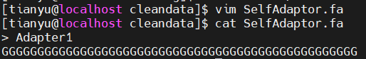

# 数据预处理

1. __FastQC__
    ```sh
    fastqc -f fastq -o output_path input_file1
    ```
    |选项|意义|
    |---|---|
    |-f|指定待分析的数据的格式|
    |-o|指定输出路径，output_path填一个路径|
    |input_file|填写待分析的数据的文件，记得是路径+文件 - `input_dir/input_file`<br>可以多个文件一起分析，比如`input_file1 input_file2`|
    
    
    下载产生的html就可以了
    <br>
2. __Trimmomatic__
   使用conda装上trimmomatic之后，可以直接调用
   ```sh
   trimmomatic PE -phred33 input_forward.fq.gz input_reverse.fq.gz output_forward_paired.fq.gz output_forward_unpaired.fq.gz output_reverse_paired.fq.gz output_reverse_unpaired.fq.gz ILLUMINACLIP:TruSeq3-PE.fa:2:30:10 LEADING:3 TRAILING:3 SLIDINGWINDOW:4:15 MINLEN:36
   ```
   举例：这里剪掉了数据中的前15bp
   ```sh
   trimmomatic PE /Bioinfo/bio_2022_2023_2/bio_nchen/ATAC-analysis/SRR23404191_1.fastq.gz /Bioinfo/bio_2022_2023_2/bio_nchen/ATAC-analysis/SRR23404191_2.fastq.gz SRR23404191_1_pair.fastq.gz SRR23404191_1_unpair.fastq.gz SRR23404191_2_pair.fastq.gz SRR23404191_2_unpair.fastq.gz HEADCROP:15
   ```
   也有人不建议用conda，听说调用命令时会提醒找不到TruSeq3-SE
   如果是自己装的，需要按照java指令进行调用:
   ```sh
   wget http://www.usadellab.org/cms/uploads/supplementary/Trimmomatic/Trimmomatic-0.39.zip
   unzip Trimmomatic-0.39.zip
   java -jar trimmomatic-0.39.jar -h
   ```
   ```sh
   java -jar <path to trimmomatic jar> PE [- threads <threads>] [ - phred33| - phred64] [-trimlog <1ogFile>] input_forward.fq.gz input_reverse.fq.gz output_forward_paired.fq.gz output_forward_unpaired.fq.gz output_reverse_paired.fq.gz output_reverse_unpaired.fq.gz ILLUMINACLIP:TruSeq3-PE.fa:2:30:10 LEADING:3 TRAILING:3 SLIDINGWINDOW:4:15 MINLEN:36
   ```
   如果发现过表达序列并非接头，而是未定义的No Hit
   
   可以仿照原有接头，自己画一个接头(fa格式)，到时候ILLUMINACLIP按照路径调用即可
   注意：只要用了ILLUMINACLIP，就要在接头文件后加上修建方式
    > 2:30:10 -> 第一步seed搜索允许2个碱基错配，palindrome 比对分值阈值30， simple clip 比对分值阈值10

   
   举例：
   ```sh
    nohup trimmomatic PE -threads 10 /Bioinfo/bio_2022_2023_2/bio_nchen/ATAC-analysis/SRR23404191_1.fastq.gz /Bioinfo/bio_2022_2023_2/bio_nchen/ATAC-analysis/SRR23404191_2.fastq.gz SRR23404191_1_pair.fastq.gz SRR23404191_1_unpair.fastq.gz SRR23404191_2_pair.fastq.gz SRR23404191_2_unpair.fastq.gz HEADCROP:15 ILLUMINACLIP:./SelfAdaptor.fa:2:30:10 MINLEN:30 &
   ```  
   常见的选项:
    |选项|含义|
    |--|--|
    |ILLUMINACLIP|过滤 reads 中的 Illumina 测序接头和引物序列，并决定是否去除反向互补的 R1/R2 中的 R2|
    |SLIDINGWINDOW|从 reads 的 5'端开始，进行滑窗质量过滤，切掉碱基质量平均值低于阈值的slide window|
    |LEADING|如果低于阈值质量，则在reads起始处剪切碱基|
    |TRAILING|如果低于阈值质量，则在reads末尾处剪切碱基|
    |CROP|从 reads 的末尾切掉部分碱基使得 reads 达到指定长度|
    |HEADCROP| 从 reads 的开头切掉指定数量的碱基|
    |MINLEN|如果reads低于指定长度，则删除|
    |TOPHRED33|将质量得分转换为Phred-33|
    |TOPHRED64|将质量得分转换为Phred-64|
    
    
    若未指定线程，则默认开启33个线程

3. __multiQC__
  安装 - 貌似conda装不上，可以用pip
   ```sh
   pip install multiqc
   ```
    集成分析 - 一键集合本文件夹下所有的qc结果，整合对象是fastqc.html和fastqc.zip，所以很快
    ```sh
    multiqc .
    ```
