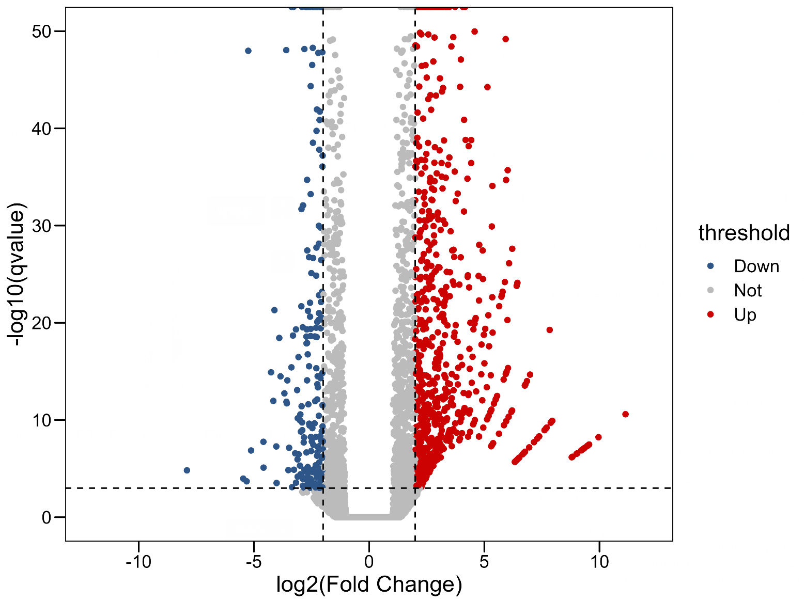
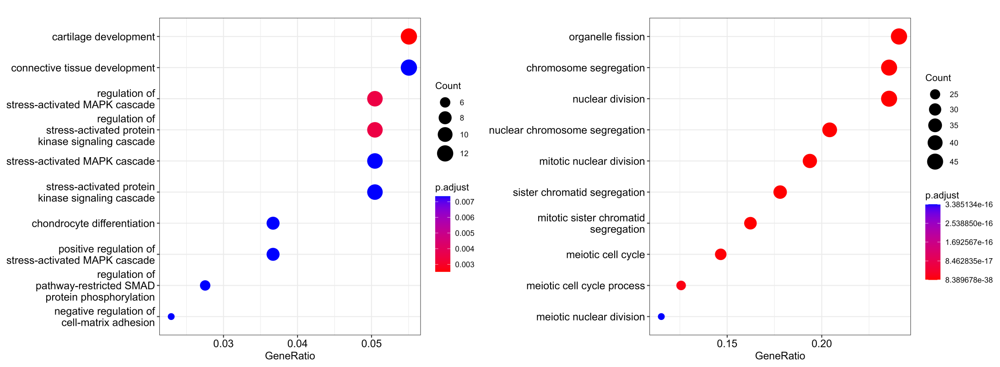

# RNA-seq分析

1. __上游分析__
使用`SubRead`中的`featureCounts`将bam文件转化为表达矩阵
    ```sh
    featureCounts [options] <input.file>
    featureCounts -p -t exon -g gene_id -a annotation.gtf -o countResult.txt input.PE.bam
    ```
    示例：
    ```sh
    featureCounts -p -t exon -g gene_id -a /Bioinfo/bio_2022_2023_2/bio_nchen/Reference/Mus_musculus.GRCm39.109.chr.gtf -T 20 -o SRR23405824countResult.txt SRR23405824.bam
    ```
    常见参数
    |参数|含义|
    |--|--|
    |-a `<string>`|参考gtf文件名，支持gz文件格式|
    |-o `<string>` | 输出文件的名字，输出文件的内容为read 的统计数目|
    |-T|线程数目，1~32|
    |-F|参考文件的格式，一般为GTF/SAF，C语言版本默认的格式为GTF格式，在-a指定gtf后_一般不再指定_|
    |-A|提供一个逗号分割为两列的文件，一列为gtf中的染色体名，另一列为read中对应的染色体名，用于将gtf和read中的名称进行统一匹配，注意该文件提交时不需要列名，_一般不指定_|
    |-J|对可变剪切进行计数，_不做可变剪接时一般不指定_|
    |-G `<string>`|当-J设置的时候，通过-G提供一个比对的时候使用的参考基因组文件，辅助寻找可变剪切，_一般不指定_|
    |-M|如果设置-M，多重map的read将会被统计到，_一般不指定_|
    |-O|允许多重比对，即当一个read比对到多个feature或多个metafeature的时候，这条read会被统计多次，_一般不指定_|

    与featrue/metafeature相关的参数
    |参数|含义|
    |--|--|
    |__-p__|只能用在paired-end的情况中，会统计fragment而不统计read|
    |-B|在-p选择的条件下，只有两端read都比对上的fragment才会被统计|
    |-C|如果-C被设置，那融合的fragment（比对到不同染色体上的fragment）就不会被计数，这个只有在-p被设置的条件下使用|
    |-d|< int >	最短的fragment，默认是50|
    |-D|< int >	最长的fragmen，默认是600|
    |-f|如果-f被设置，那将会统计feature层面的数据，如exon-level，否则会统计meta-feature层面的数据，如gene-levels|
    |__-g `<string>`__|当参考的gtf提供的时候，我们需要提供一个id identifier 来将feature水平的统计汇总为meta-feature水平的统计，默认为gene_id，注意！选择gtf中提供的id identifier！！！|
    |__-t `<string>`__|设置feature-type，-t指定的必须是gtf中有的feature，同时read只有落到这些feature上才会被统计到，默认是“exon” <br> 如果不确定可以打开gtf看看到底是什么类型|

3. 下游分析
   __利用`DESeq2`进行下游分析__
   安装`DESeq2`:
   ```R
   if (!requireNamespace("BiocManager", quietly = TRUE))
    install.packages("BiocManager")

   BiocManager::install("DESeq2")
   ```
   下载小鼠基因注释包 - [Guideline](https://bioconductor.org/packages/release/data/annotation/html/org.Mm.eg.db.html)
   ```R
   if (!require("BiocManager", quietly = TRUE))
    install.packages("BiocManager")

    BiocManager::install("org.Mm.eg.db")
   ```
=== 开始分析 ===
  首先把数据读进来，构建正确的、可以使用的表达矩阵
  ```R
  countData5824 <- read.table("SRR23405824countResult.txt", sep = "\t", header = TRUE, row.names=1)
  countData5829 <- read.table("SRR23405829countResult.txt", sep = "\t", header = TRUE, row.names=1)
  count5824 <- countData5824[c('SRR23405824.bam')] #bam列是表达量
  count5829 <- countData5829[c('SRR23405829.bam')]
  rm(countData5824)
  rm(countData5829)
  colnames(count5824) <- c("CK")
  colnames(count5829) <- c("Treatment")

  Data <- cbind(count5824, count5824, count5829, count5829)
  colnames(Data) <- c("CK_1", "CK_2", "Treatment_1", "Treatment_2") 
  condition <- factor(c("CK", "CK", "Treatment", "Treatment"))
  coldata <- data.frame(row.names=colnames(Data), condition)
  rm(count5824)
  rm(count5829)
  ```
  构建表达矩阵
  ```R
  dds <- DESeq2::DESeqDataSetFromMatrix(countData=Data, 
                                        colData=coldata, design= ~condition)
  ```
  对数据进行过滤与归一化，这里是[具体原理](https://www.jianshu.com/p/8aa995149744)
  ```R
  dds <- dds[rowSums(BiocGenerics::counts(dds)) > 100, ] #过滤低表达量的基因
  dds <- estimateSizeFactors(dds) #计算量化因子, 生成新的一列
  dds <- estimateDispersionsGeneEst(dds) #计算离散因子, 生成新的一列
  dispersions(dds) <- mcols(dds)$dispGeneEst #计算离散度
  dds <- nbinomWaldTest(dds) #Negative Binomial GLM fitting and Wald statistics, 根据刚刚计算的量化因子和离散因子，生成可用的表达矩阵
  resdata <- data.frame(results(dds, lfcThreshold=1, alpha=0.05)) 
  write.csv(resdata,file= "DESeq2_logFC.csv")
  ```
  绘制火山图
  ```R
  threshold <- as.factor(ifelse(resdata$padj < 0.001 & 
                                  abs(resdata$log2FoldChange) >= 2 ,
                                ifelse(resdata$log2FoldChange >= 2 ,
                                      'Up','Down'),'None')) 
  gene.df <- bitr(resdata$ENSEMBL, "ENSEMBL", "SYMBOL", OrgDb = org.Mm.eg.db)
resdata <- right_join(resdata, gene.df, by="ENSEMBL", multiple = "all")
resdata$label <- ""
resdata[resdata$padj < 0.001 & abs(resdata$log2FoldChange) >= 5,]$label <- resdata[resdata$padj < 0.001 & abs(resdata$log2FoldChange) >= 5,]$SYMBOL
resdata[resdata$log2FoldChange >= 5,]$label <- resdata[resdata$log2FoldChange >= 5,]$SYMBOL

  ggplot(resdata, aes(x=log2FoldChange, y=-log10(padj), colour=threshold)) +
    xlab("log2(Fold Change)")+ylab("-log10(qvalue)") +
    geom_point() +
    ylim(0,50) + xlim(-12,12) +
    scale_color_manual(values=c("#2F5688", "#BBBBBB", "#CC0000"))+
    theme_base()+
    geom_text_repel(
      aes(label = label),
      size = 3,
      segment.color = "black", show.legend = FALSE )+
    geom_hline(yintercept = -log10(0.001), linetype = "dashed")+
    geom_vline(xintercept = c(-2, 2), linetype = "dashed")
   ```
 结果：
  
  GO富集分析
  ```R
  subset(resdata,pvalue < 0.001) -> diff
  subset(diff,log2FoldChange < -2) -> down
  subset(diff,log2FoldChange > 2) -> up

  down_geo <- clusterProfiler::enrichGO(gene = rownames(down), keyType = "ENSEMBL",
                                        OrgDb = BiocGenerics::get("org.Mm.eg.db"), 
                                        ont = "BP",
                                        pAdjustMethod = "BH", qvalueCutoff = 0.05)

  enrichplot::dotplot(down_geo, showCategory = 10)

  up_geo <- clusterProfiler::enrichGO(gene = rownames(up), keyType = "ENSEMBL",
                                      OrgDb = BiocGenerics::get("org.Mm.eg.db"), 
                                      ont = "BP",
                                      pAdjustMethod = "BH", qvalueCutoff = 0.05)

  enrichplot::dotplot(up_geo, showCategory =10)
  ```
  对于keyType的设定，可以先使用`colname("org.Mm.eg.db")`看一下
  结果：
  
  ```R
  df_id <- bitr(resdata$SYMBOL, fromType = "SYMBOL", toType = "ENTREZID", OrgDb = "org.Mm.eg.db")
  df_all<-merge(resdata, df_id, by="SYMBOL", all=F)
  df_all_sort <- df_all[order(df_all$log2FoldChange, decreasing = T),]
  gene_fc <- df_all_sort$log2FoldChange
  names(gene_fc) = df_id$ENTREZID
  rm(df_id, df_all, df_all_sort)
  KEGG <- gseKEGG(geneList = gene_fc, organism = 'mmu')
  ```
  出现报错：`Failed to download KEGG data. Wrong 'species' or the network is unreachable`
  问题原因：[KEGG API has moved to HTTPS](https://github.com/YuLab-SMU/clusterProfiler/issues/470), 更新到最新的`clusterProfiler`即可
  解决方案：`R.utils::setOption("clusterProfiler.download.method",'auto')`或者`use 'wininet' to download KEGG data when .Platform$OS.type = "windows"`, 参考[issue](https://github.com/YuLab-SMU/clusterProfiler/pull/471)

  出现新报错：
  > preparing geneSet collections...
  --> Expected input gene ID: 
  Error in check_gene_id(geneList, geneSets) : 
    --> No gene can be mapped....
    
  出现原因：不知道
  解决方案：不想解决了，换一个包吧
