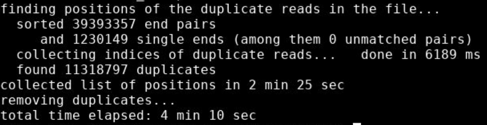
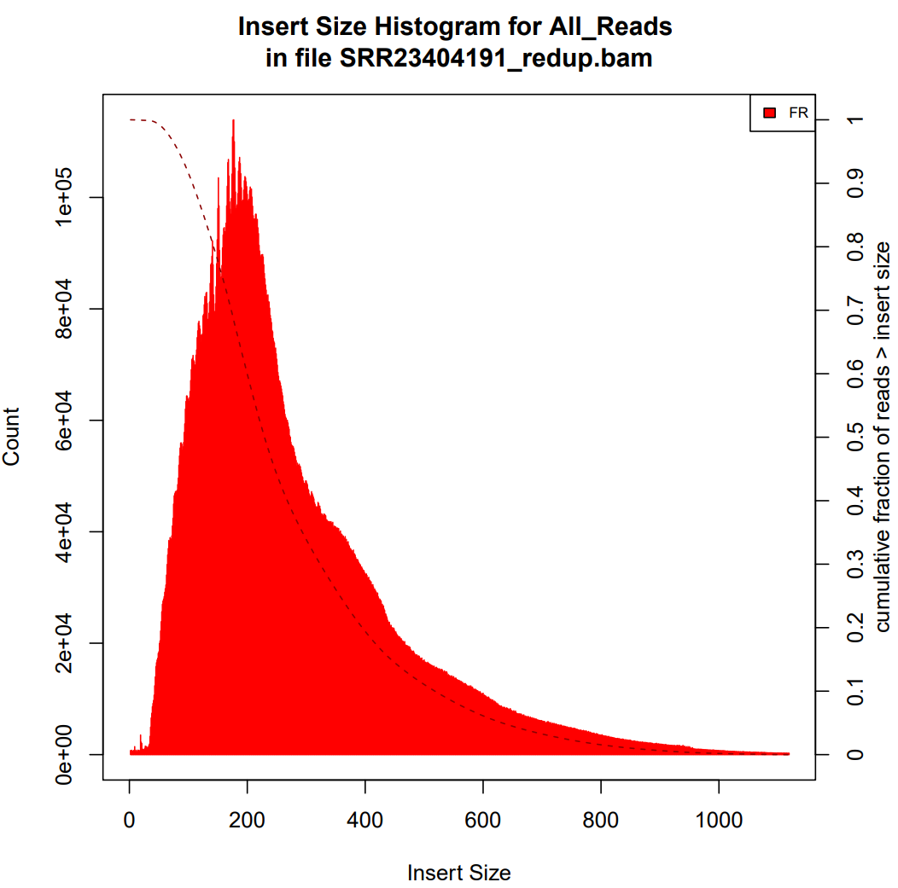
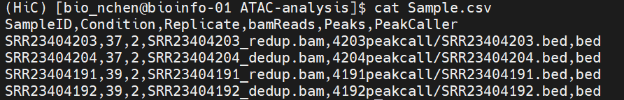

# ATAC-seq分析

#### 对于ATAC-seq的分析流程，ChatGPT说：
1. 质控和数据预处理：这个步骤用于对原始数据进行质量控制和预处理。例如，可以使用FastQC软件对原始数据进行质量评估，然后使用Trimmomatic软件对低质量序列进行过滤和修剪。
2. 对参考基因组进行比对：使用Bowtie2、BWA-MEM、STAR等软件将ATAC-seq测序reads比对到参考基因组上，生成.bam格式的比对文件。
3. 去除PCR扩增引入的偏差：由于PCR扩增过程中会引入偏差，因此需要使用Picard、samtools等工具去除PCR扩增引入的重复序列。
4. 剪接位点的检测和注释：使用Peak-calling软件（如MACS2、Homer、Genrich）对.bam文件进行处理，识别出剪接位点并注释其与周围基因的位置关系。
5. 基因功能富集分析：使用基因功能富集分析软件（如HOMER、GREAT）对显著的剪接位点进行富集分析，以了解这些位点在哪些生物学过程中发挥重要作用。
6. 可视化和结果展示：使用IGV、UCSC Genome Browser等软件将.bam和.bed等格式的结果文件进行可视化展示。

#### 上游分析指南
1. __利用`sambamba`去除基因组中的重复__
   ```sh
   sambamba-markdup [options] <input.bam> [<input2.bam> [...]] <output.bam>
   ```
   举例：
   ```sh
   sambamba markdup -r -t 20 SRR23404191.bam SRR23404191_redup.bam
   ```
   注意：By default, sambamba jyst marks the duplicates without removing them
   |选项|含义|
   |--|--|
   |-r|--remove-duplicates|
   |-t|--nthreads=NTHREADS|
   |-l|--compression-level=N|
   |-p|--show-progress|
   
   结果：
   
   其实`picard`也可以做到，指令是
   ```sh
   picard MarkDuplicates REMOVE_DUPLICATES=True I=SRR23404204.bam O=SRR23404204_dedup.bam M=SRR23404204_dedup.txt
   ```
<br>

2. __利用`MACS2`进行peak calling__

   可以查看[MACS2简明教程](https://www.jianshu.com/p/21e8c51fca23)
   安装
   ```sh
   pip install macs2
   ```
   ```sh
   conda install -c bioconda macs2
   ```
   ```sh
   wget https://files.pythonhosted.org/packages/e2/61/85d30ecdd34525113e28cb0c5a9f393f93578165f8d848be5925c0208dfb/MACS2-2.2.7.1.tar.gz
   tar zxvf MACS2-2.2.7.1.tar.gz
   cd MACS2-2.2.7.1/
   python setup.py install
   ```
   使用：
   ```sh
   macs2 callpeak -t ChIP.bam -c Control.bam -f BAM -g hs -n test -B -q 0.01 #常规的peak calling - 转录因子(结合位置较窄)
   macs2 callpeak -t ChIP.bam -c Control.bam --broad -g hs --broad-cutoff 0.1 #较宽的peak calling - 组蛋白(结合位置较宽)
   ```
   举例：
   ```sh
   macs2 callpeak -t SRR23404191_redup.bam -c SRR23404203_redup.bam -f BAM -g mm -n ATAC -B -q 0.01
   macs2 callpeak -t SRR23404191_redup.bam -f BAM -g mm -n ATAC -B
   ```
   |参数|含义|
   |--|--|
   |-t/--treatment & -c/--control|处理样本和对照样本输入|
   |-f/--format|声明输入的文件格式，目前MACS能够识别的格式有 "ELAND", "BED", "ELANDMULTI", "ELANDEXPORT", "ELANDMULTIPET" (双端测序), "SAM", "BAM", "BOWTIE", "BAMPE", "BEDPE". 除"BAMPE", "BEDPE"需要特别声明外，其他格式都可以用AUTO自动检测|
   |-n/--name|表示实验的名字, 可以自己随便起个名字|
   |-B/--bdg|以bedGraph格式存放fragment pileup, control lambda, -log10pvalue 和log10qvale|
   |-q|设定q值(最小的FDR)的阈值，默认0.05。可以根据结果进行修正。q值是p值经Benjamini–Hochberg–Yekutieli修正后的值。更多关于q值的设定参考官方手册或[使用指南](https://www.jianshu.com/p/6a975f0ea65a)，一般都使用默认，默认效果不好再调整|
   |-g|表示使用什么基因组|

   但其实用了 __`MACS3`__ ，指导手册见[GitHub](https://github.com/macs3-project/MACS/blob/master/docs/source/docs/callpeak.md)
   ```sh
   conda create -n macs3 python == 3.9
   conda activate macs3
   conda install numpy cython

   pip intsall macs3
   ```
   
   ```sh
   macs3 callpeak --nomodel -B -f BAMPE -t SRR23404191.bam -n 4191callpeak --nolambda --gsize mm 
   ```

4. __使用bedtools把有peak的fastq拎出来__

   首先需要用samtools对索引排序
   ```sh
   samtools faidx /Bioinfo/bio_2022_2023_2/bio_nchen/Reference/Mus_musculus.GRCm39.dna.primary_assembly.fa
   ```
   `awk`+`bedtools`提取序列
   ```sh
   > awk '{print $1"\t" $2"\t" $3}' ./4203callpeak_peaks.narrowPeak > SRR23404203.bed
   > bedtools getfasta -fi /Bioinfo/bio_2022_2023_2/bio_nchen/Reference/Mus_musculus.GRCm39.dna.primary_assembly.fa -fo SRR23404191.fa -bed SRR23404191.bed
   ```

5. __使用`picard`统计结果中insertsize长度的分布__ <br>
   ```sh
   picard CollectInsertSizeMetrics \
        I=sorted.mkdup.bam \   # 比对后取出pcr重复后的bam文件
        O=insert_size_metrics.txt \   # 输出txt文件
        H=insert_size_histogram.pdf \   # 输出含统计图的Pdf文件
   ```
   结果：感觉很烂，但是勉勉强强做下去吧
   

6. __利用`MEME ChIP`可视化结果__ 

   这是一个有交互页面的寻找MEME的toolkit<br>
   可能需要比较久，记得留下邮箱

7. __利用`ChIPseeker`进行注释__ <br>
   ```r
   library(ChIPseeker)
   library(GenomicFeatures)
   library(patchwork)

   peak <- readPeakFile("./SRR23404203.bed")
   spompe <- makeTxDbFromGFF("./Mus_musculus.GRCm39.109.chr.gtf")
   # peaks <- list(peak1 = peak1, peak2 = peak2)

   peakAnno <- annotatePeak(peak, tssRegion = c(-3000, 3000), TxDb = spompe)
   write.table(peakAnno, file = 'peak.txt',sep = '\t', quote = FALSE, row.names = FALSE)

   pdf("./peakannotation.pdf")
   plotAnnoBar(peakAnno)
   vennpie(peakAnno)
   plotAnnoPie(peakAnno)
   plotDistToTSS(peakAnno)
   dev.off()
   ```

8. __利用`DiffBind`进行比较__ <br>
   确定样本之间有差异的位点。它包括支持峰集处理的功能，包括重叠和合并峰集，在峰集里进行重叠区间的测序read计数，以及基于结合亲和的证据(通过read密度的差异测定)识别统计上显著的差异结合位点。<br>
   流程包括：读取峰集、occupancy分析、reads计数、差异接合分析<br>
   捏一个Sample.csv<br>
   
   ```R
   data <- dba(sampleSheet='Sample.csv', dir="/Bioinfo/bio_2022_2023_2/bio_nchen/ATAC-analysis/")
   dba.plotHeatmap(data)
   data_count <- dba.count(data, summits = 100, bRemoveDuplicates = TRUE, score=DBA_SCORE_READS)
   data_normalized <- dba.normalize(data_count, library = "full", normalize = "RLE",  method=DBA_DESEQ2)
   dba.plotHeatmap(data_normalized, score = DBA_SCORE_NORMALIZED)
   dba.plotPCA(data_normalized, score = DBA_SCORE_NORMALIZED, DBA_CONDITION, label = DBA_ID)
   dba.plotVenn(data, data$masks$"37")
   dba.plotVenn(data, data$masks$"39")
   venn <- dba.peakset(data, consensus=DBA_CONDITION, minOverlap=2) 
   dba.plotVenn(venn, venn$masks$Consensus)
   ```
   ```R
   data_normalized <- dba.contrast(data_normalized, contrast=c("Condition","39","37"))
   data_analyzed <- dba.analyze(data_normalized, method = DBA_DESEQ2)
   dba.analyze(data_analyzed, bRetrieveAnalysis=TRUE)
   dba.plotMA(data_count, contrast=list(Differentiated=data_count$masks$39), bNormalized=FALSE, sub="Non-Normalized") #未标准化，图有点丑
   dba.plotMA(data_analyzed,method=DBA_DESEQ2)
   data_temperature.report <- dba.report(data_analyzed, th = 1, fold = 0, method = DBA_DESEQ2, bCounts = T)
   data_temperature.df <- as.data.frame(data_temperature.report)
   write.table(data_temperature.df, "37v39_DAR_table.txt", quote = F, row.names = F)

   cols = c(rgb(255, 0, 0, max = 255, alpha = 25), rgb(0, 0, 0, max = 255, alpha = 25))
   with(data_temperature.df, plot(Fold, -log10(FDR), 
   + pch=20, main="Differential peak accessibility between 39 and 37", col = ifelse(FDR<0.05 & abs(Fold)>1, "red", "black"), 
   + cex = 0.75)) + abline(v=c(-1,1), lty = "dotted") + abline(h=-log10(0.05), lty = dotted")
   ```

9. __绘制Profile图__
   ```sh
   samtools index SRR23404191_redup.bam
   bamCoverage -b SRR23404191_redup.bam  -o SRR23404191.bw
   awk '$3 == "gene"' ../Reference/Mus_musculus.GRCm39.109.chr.gtf | awk 'BEGIN{FS="\t|=|;";OFS="\t"}{print $1,$4-1,$4}'>gene.bed
   computeMatrix reference-point --referencePoint TSS  -p 15 -b 10000 -a 10000 -R gene.bed -S SRR23404191.bw --skipZeros  -o matrix_test_TSS.gz --outFileSortedRegions regions_test_genes.bed 
   #如果想画多个，那就-S多输入几个bw
   plotHeatmap -m matrix_test_TSS.gz -out test_Heatmap.png
   ```

   
