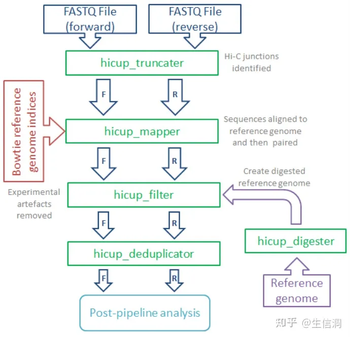
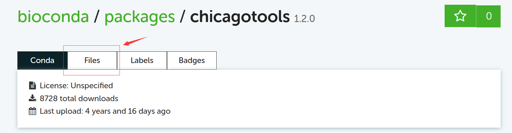
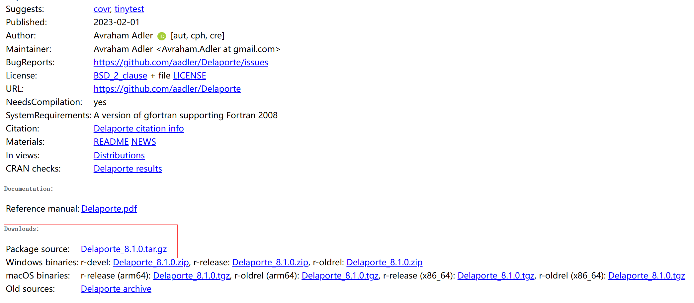

# HiC分析流程

### 4DN推荐分析流程
若为HiC及其衍生实验，使用`bwa`比对后利用`pairtools`提取染色质交互对，接着使用`cooler`生成.cool文件，再用`hiccups`进行loop calling。<br>
若为ChIA-PET及其衍生实验，则使用ChIA-PET Tools V3完成数据处理，生成染色质交互簇

### HiCUP进行HiC数据的预处理
   
   [参考手册](https://www.bioinformatics.babraham.ac.uk/projects/hicup/read_the_docs/html/index.html)
1. __`hicup_digester`构建参考基因组__


   HiCUP Digester通过指定Type II限制性内切酶来切割参考基因组(模拟酶切)，从而生成整个参考基因组的酶切位点文件，其作为HiCUP Filter的输入文件对HiC数据进一步过滤。
   ```sh
   hicup_digester --genome reference_name --re1 A^AGCTT,HindIII input_path/refence.fa --outdir outdir/
   ```   
   举例：
   ```sh
   hicup_digester --genome GRCm39 --re1 A^AGCTT,HindIII ../Reference/Mus_musculus.GRCm39.dna.primary_assembly.fa
   ```
   常见参数：
   |参数|含义|
   |--|--|
   |--re1|指定限制性核酸内切酶与酶切位点|
   |--genome|输出文件的名称，并不是参考基因组的位置与名称|
   注意：使用的参考基因组是建过索引的基因组，好像bwa/bowtie的索引都可以，但是`hicup`运行需要bowtie，所以还是安安心心bowtie建一个参考基因组索引吧
   ```sh
   bowtie-build --threads 40 ../Reference/Mus_musculus.GRCm39.dna.primary_assembly.fa GRCm39-bowtie
   ```
   用bowtie建立的索引会有六个结果文件，四个.bt2文件，两个rev.bt2文件。
<br>

3. __生成配置文件__
   ```sh
   hicup --example
   vim hicup_example.conf
   ```
   example之后会生成一个含有框架的hicup脚本，只有bowtie、index、digest、fastq的路径需要更改；当然要是能改个名就更好啦
   ```sh
   #Example configuration file for the hicup Perl script - edit as required
   ########################################################################

   #Directory to which output files should be written (optional parameter)
   #Set to current working directory by default 
   Outdir:./

   #Number of threads to use
   Threads: 20

   #Suppress progress updates (0: off, 1: on)
   Quiet:0

   #Retain intermediate pipeline files (0: off, 1: on)
   Keep:0

   #Compress outputfiles (0: off, 1: on)
   Zip:1

   #Path to the alignment program (Bowtie or Bowtie2)
   #Remember to include the executable Bowtie/Bowtie2 filename.
   #Note: ensure you specify the correct aligner i.e. Bowtie when 
   #using Bowtie indices, or Bowtie2 when using Bowtie2 indices. 
   #In the example below Bowtie2 is specified.
   Bowtie2:/home/software/bowtie2-2.4.5-linux-x86_64/bowtie2

   #Path to the reference genome indices
   #Remember to include the basename of the genome indices
   Index: ./GRCm39-bowtie

   #Path to the genome digest file produced by hicup_digester
   Digest: ./Digest_GRCm39_HindIII_None_09-29-12_22-03-2023.txt

   #FASTQ format (valid formats: 'Sanger', 'Solexa_Illumina_1.0', 'Illumina_1.3' or 'Illumina_1.5')
   #If not specified, HiCUP will try to determine the format automatically by analysing
   #one of the FASTQ files. All input FASTQ will assumed to be in this format
   Format: Sanger 

   #Maximum di-tag length (optional parameter)
   Longest: 700

   #Minimum di-tag length (optional parameter)
   Shortest: 50

   #FASTQ files to be analysed, placing paired files on adjacent lines
   /Bioinfo/bio_2022_2023_2/bio_nchen/hic/SRR11041269_1.fastq.gz
   /Bioinfo/bio_2022_2023_2/bio_nchen/hic/SRR11041269_2.fastq.gz
   ```
   Bowtie2：路径要写到可执行文件
   index: 只要写到专用的后缀前面，common的部分就行，比如这里就写到`./GRCm39-bowtie`，它会自己识别六个bt2文件。
   input fastq文件：运行之后会生成`trunc.fastq.gz`文件，第二次运行之后需要删除这些`trunc.fastq.gz`文件才能继续运行；除此之外还会生产summary文件。

---
### 按照HiC进行下游分析

1. 利用`pairtools`进行下游分析
   安装
   ```sh
   conda install -c conda-forge -c bioconda pairtools
   ```
   使用，最终生成output.pairs
   ```sh
   samtools view -h SRR11041269_1_2.hicup.bam | pairtools parse -c GRCm39.chorm.size
   chorm.size -o parsed.pairsam
   pairtools sort --nproc 20 -o sorted.pairsam parsed.pairsam
   pairtools dedup --mark-dups -o deduped.pairsam sorted.pairsam
   pairtools select '(pair_type == "UR") or (pair_type == "UU") or (pair_type == "RR")' -o selected.pairsam deduped.pairsam
   pairtools split --output-pairs output.pairs selected.pairsam
   ```
2. 利用`pairix`对output.pairs建立索引
   ```sh
   bgzip output.pairs #samtools的指令
   pairix -f output.pairs.gz #pairix的输入必须是gz文件
   ```
3. 利用`cooler`进行下游分析
   ```sh
   cooler cload pairix GRCm39.chorm.size:10000 output.pairs.gz out.10000.cool #生成contact矩阵
   cooler balance -p 10 out.10000.cool #标准化数据，因为染色体长度不一样
   ```
   换去python，或者变成脚本挂上
   ```python
   import cooler
   import numpy as np
   import matplotlib.pyplot as plt
   c = cooler.Cooler('out.500000.cool')
   resolution = c.binsize
   mat = c.matrix(balance=True).fetch('5:10,000,000-15,000,000') #指定区域
   mat = c.matrix(balance=True) #全基因组
   plt.matshow(np.log10(mat), cmap='YlOrRd')
   plt.savefig("./chr5.jpg")
   ```
   

#### 使用`HiC-Pro`绘制contact map
安装：
```sh
mkdir HiCPro #建一个文件夹，开启一个伟大的征程
mkdir HiC-Pro #建一个文件夹，最终可执行的程序保存在这里
cd HiCPro
wget -c https://github.com/nservant/HiC-Pro/archive/refs/tags/v3.1.0.tar.gz #下载安装包
tar -zxvf v3.1.0.tar.gz
vim environment.yml #根据GitHub上提供的yml写入
conda env create -f environment.yml
conda activate HiC-Pro_v3.1.0
cd HiC-Pro-v3.1.0
vim config-install.txt #将HiC-Pro的路径写入
make configure
make install
```
把HiC-Pro放进.bashrc
```sh
export PATH=/Bioinfo/bio_2022_2023_2/bio_nchen/HiC-Pro/HiC-Pro-3.1.0/bin:$PATH
```
装上了，但是不会用

#### 利用`HiCexplorer`进行后续分析
```sh
hicPCA -m out.500000.cool --outputFileName pca1.bw pca2.bw --pearsonMatrix pearson.h5 -we 1 2
hicPlotMatrix -m pearson.h5 --outputFileName pca1.jpg --perChr --bigwig pca1.bw
```
失败了

---
### 按照pc-HiC进行下游分析
#### 使用`CHiCAGO`进行下游分析
有一篇[nature protocol](https://www.nature.com/articles/s41596-021-00567-5)的guideline，不过我觉得没什么用，还是[README.md](./6-CHiCAGOTool-README.html)好用
   用conda装R包
   ```sh
   conda install -c bioconda bioconductor-chicago
   ```
   也可以在conda的页面下源码
   
   `https://cran.r-project.org/`也有源码地址
   
注意：`CHiCAGOTool`是由python 2编码的，所以在调用的时候注意版本
生成designfile
```sh
/bin/python makeDesignFiles.py --designDir=./ --rmapfile=./Digest_mm10_HindIII.rmap --baitmapfile=./Digest_mm10_HindIII.baitmap --outfilePrefix=./designfile --minFragLen=150 --maxFragLen=40000 --maxLBrownEst=1500000 --binsize=20000 --removeb2b=True --removeAdjacent=True
```
将bam文件转换为chinput
```sh
bash bam2chicago_V02.sh --bamfile ./SRR11041269_1_2.hicup.bam --baitmap ./Digest_mm10_HindIII.baitmap --rmap ./Digest_mm10_HindIII.rmap -o SRR11041269 --nodelete
```
跑不通，放弃。

